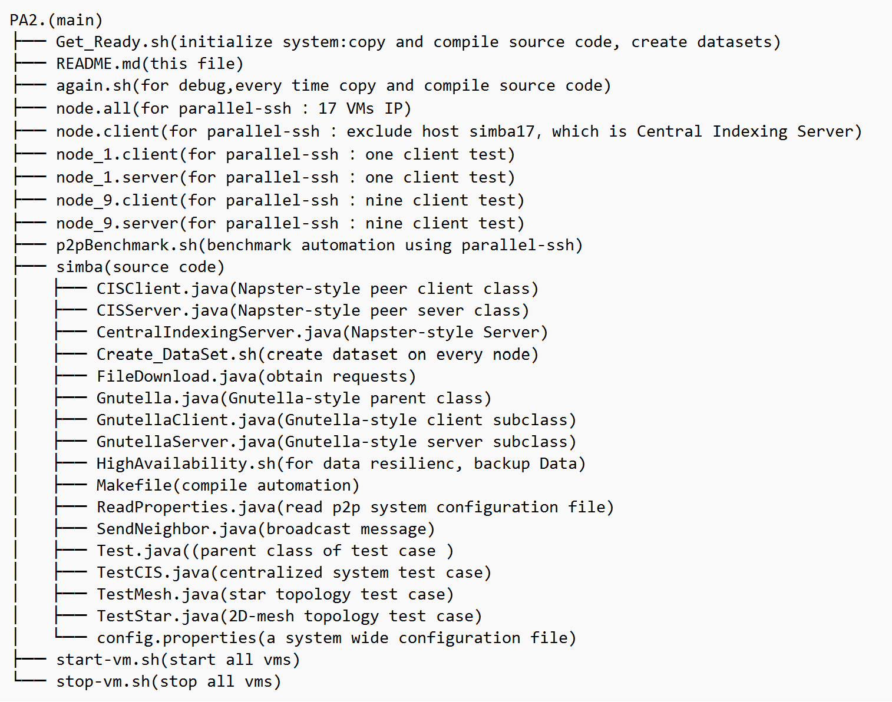

# A Simple Decentralized Peer to Peer File Sharing System

## _CS 550 Programming Assignment #2_

## Features
**PA1: -10 (C5: Unable to confirm replication factor) has been fixed in this assignment. Please see Section 1.4 for details.**

Base on PA1 and according to PA2 outline, in addition to the outline requirements, I implement P2P features as following:

- Implement data resilienc mechanism with a system wide the replication factor, based on residual algorithm. I was penalized for 10 points for PA1 because of this fuction.
- Implement transfer throughput Small function: 9 clients concurrently issue 10K query+obtain requests each for random files from Small dataset(Bonus 2%).
- My P2P system support any type of files (e.g. text, binary, etc) up to 4GB in size
- Utilizing java multithreading pool technology，build an efficient decentralized P2P system.
- Utilizing shell script ，implement development, deployment, testing automation.

## Key Point

For decentralized P2P system, flow Control is very important. With this programming assignment,I have learned the following things:

- A peer SHOULD forward incoming Query messages to all of its directly connected servents, except the one that delivered the incoming Query.
- A peer receiving a message with the same Message ID as one it has received before, MUST discard the message. It means the message has already been seen.
- A peer that receives a HitQuery message with Message ID = n, but has not seen a Query message with Message ID = n SHOULD remove the QueryHit message.
- The TTL value of a new query created by a peer SHOULD NOT be higher than 7, and MUST NOT be higher than 10. The hops value MUST be set to 0.

## Design & Devolepment

Deployment of 1 host（simba） and 17 vms（simba01-simba17）on the Chameleon experimental platform. The host is used to manage 17 vms, which are used to run PA2 tasks, where simba17 is used for the server.The file directory and program functions on the host computer are shown below:


## Supporting tools

- **parallel-ssh series** bootstrapping of P2P system, as well as to automate and conduct the performance evaluation concurrently.
- **Intellij Idea** remote Development tools, to connect to host on Chameleon with the IDE backend running there from my local machine.
- **Tmux** a terminal multiplexe, very useful for running multiple programs with a single connection.
- **Screen** provides the ability to launch and use multiple shell sessions from a single ssh session.

## Deployment

Deploy 1 host and 17 VMs.

Create first vm, install jdk, parallel-ssh, sshpass etc. on host run lxc copy command to create other vms. after successes use ssh-keygen, ssh-copy-id to build passwordless environment.

```sh
sudo lxc launch images:ubuntu/22.04 simba01 --vm -c limits.cpu=1 -c limits.memory=6GiB
sudo lxc copy simba01 simba02 --verbose
sudo ssh-keygen -f /home/haoran/.ssh/keys/simba01
sudo ssh-copy-id -i /home/haoran/.ssh/keys/simba01 haoran@simba01
```

When the vms runs successfully, use start-vm.sh, stop-vm.sh script on host to manage vms.Use Get_Ready.sh script to distribute source code, compile, and generates 100k small files (10KB), 10 large files (100MB) and 1 large files (4GB) in a directory named shared. I also use parallel-ssh commands to monitor and kill process:

```sh
sshpass -p password parallel-ssh -h node.all -l haoran --par 50 -A -i --timeout 0 "lsof -i:60001"
sshpass -p password parallel-nuke -h node.all -v -l haoran -A java

```

Modify the configuration information on host in the config.properties file(in /PA2/simba) before use Get_Ready.sh distribute to each node . The parameters are described as follows(not the whole, only for example)：

| Parameter                                  | Meaning                             |
| ------------------------------------------ | ----------------------------------- |
| Shared_Directory = shared                  | share file directory                |
| Small_Files = All_Node.small               | use for random sample small dataset |
| Large_Files = All_Node.large               | use for random sample large dataset |
| Replication_Factor = 1                     | a system wide replication factor    |
| Star_simba01_Neighbors = simba02...simba16 | For star topology                   |
| Mesh_simba01_Neighbors = simba02,simba05   | For 2D-mesh topology                |
| simba01_IP = 10.108.74.142                 | Each client node IP                 |
| simba01_Server_Port = 60001                | Each client server port             |
| Central_Indexing_Node = simba17            | central indexing server             |
| CIS_IP = 10.108.74.213                     | central indexing server IP          |
| CIS_Port = 60001                           | central indexing server port        |

## Test

For interactive test, use command as following(take star topology for example)，first startup 15 star server(simba02-simba16) on host, then run client on simba01:

```sh
haoran@simba:~/PA2$ sshpass -p password parallel-ssh -h node_1.server -l haoran -A --par 50 --timeout 0 "cd /home/haoran/PA2;java GnutellaServer Star &"
haoran@simba01:~/PA2$ java GnutellaClient Star
```

For batch benchmark run p2pBenchmark.sh on host(make it executable with chmod u+x p2pBenchmark.sh and invoke it with ./p2pBenchmark.sh) or execute shell command from script to run test one by one. Note: If no argument provide, include all.

```sh
haoran@simba:~/PA2$ ./p2pBenchmark.sh [Star, Mesh, Central]
```

For gathering test results：

```sh
sshpass -p password parallel-slurp -h node.client -l haoran -A -L ./result /home/haoran/PA2/CIS_benchmark.txt cis_result
```
