# DataSys Coin (DSC) Blockchain

## _CS 550 Project – Checkpoint #1_

## Features

In the checkpoint1 phase, key features as following:

- Utilizing SHA256 and Blake3 hashing algorithms.
- Read/Write config file in YAML, and set dsc-key.yaml permission to 400.
- Store the config file in Base58 encoding.
- Utilizing java multithreading pool technology，build an efficient Centralized Blockchain system.

## Function Overview

Base on the outline requirements of checkpoint 1 , I implement Blockchain functions as following:

- For wallet: create wallet(if dsc-key.yaml already exists, wallet create aborted), key operation, balance operation, send operation, transaction operation.
- For blockchain: build a skeleton framework for the blockchain server.
- For pool: build a skeleton framework for the pool server.
- For metronome: build a skeleton framework for the metronome server.
- For validator: all functionalities requested in checkpoint1 phase were realized, including POW and POM proof algorithms.
- For POW: initialize by loading fingerprint/public_key value from YAML file.
- For POM: store the hashes in-memory file, sort them and lookups with binary search.

## Devolepment

The source code files in the checkpoint1 are shown below:
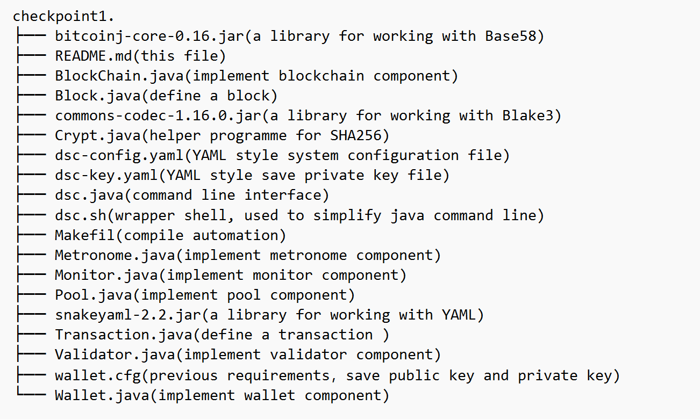

## Environment

- **OS** ubuntu 22.04 jammy.
- **Java** openjdk 11.
- **External Library** bitcoinj-core-0.16.jar, commons-codec-1.16.0.jar and snakeyaml-2.2.jar.

## compile

```sh
make clean
make
```

## run

You can use java command line:

```sh
java -Xmx26g -Xbootclasspath/a:snakeyaml-2.2.jar:bitcoinj-core-0.16.jar:commons-codec-1.16.0.jar dsc help
```

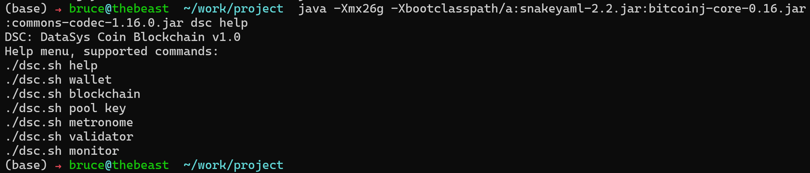
or use bash shell tool:

```sh
chmod +x ./dsc.sh
./dsc.sh help
```

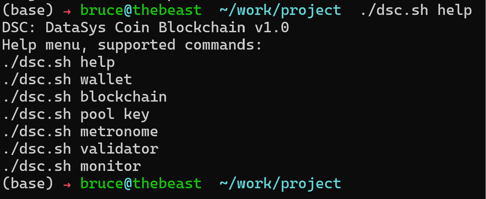

## Test

For interactive test, first startup pool server, blcokchain erver, metronome server use command as following:

```sh
./dsc.sh pool
```

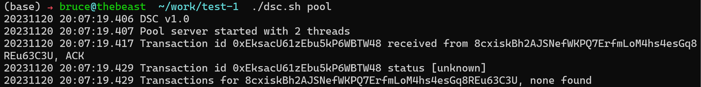

```sh
./dsc.sh blockchain
```

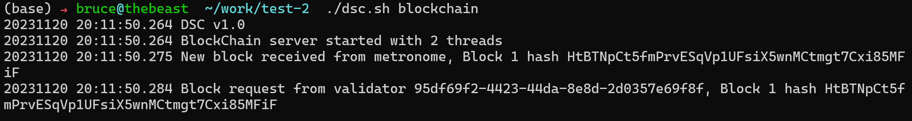

```sh
./dsc.sh metronome
```

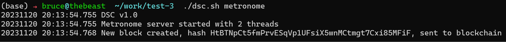

For wallet test:

```sh
./dsc.sh wallet create
```

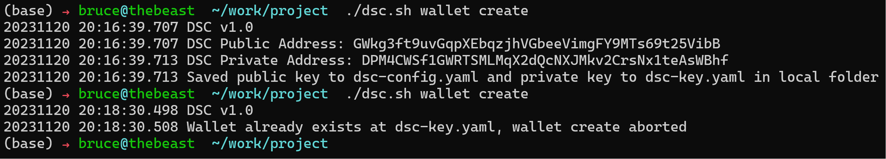

```sh
./dsc.sh wallet key
```

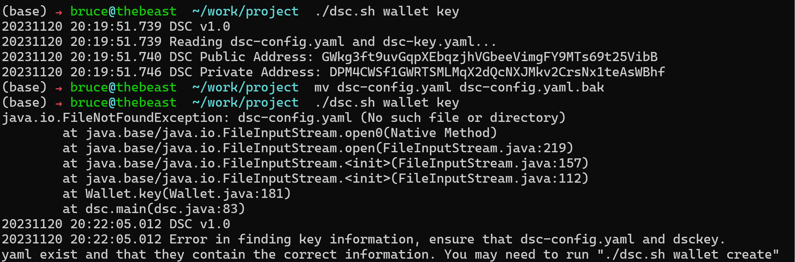

```sh
./dsc.sh wallet balance
```

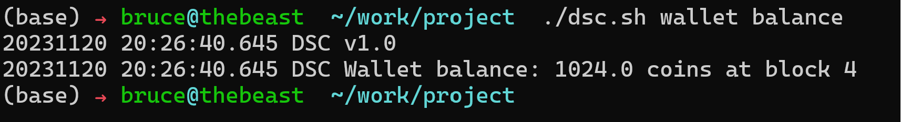

```sh
./dsc.sh wallet send 1.0 GWkg3ft9uvGqpXEbqzjhVGbeeVimgFY9MTs69t25VibB
```

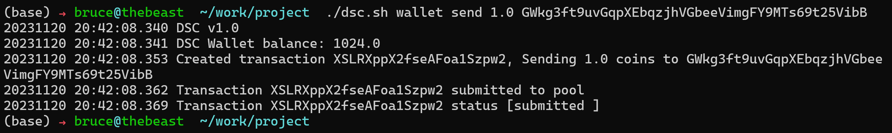

```sh
./dsc.sh wallet transaction EksacU61zEbu5kP6WBTW48
```

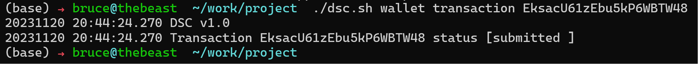

```sh
./dsc.sh wallet transaction
```

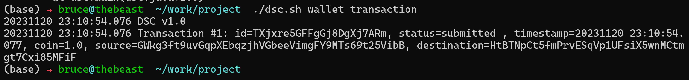

For validator POW test, be sure in dsc-config.yaml file validator/proof_pow/enable set to 'True', other is 'False':

```sh
./dsc.sh validator
```

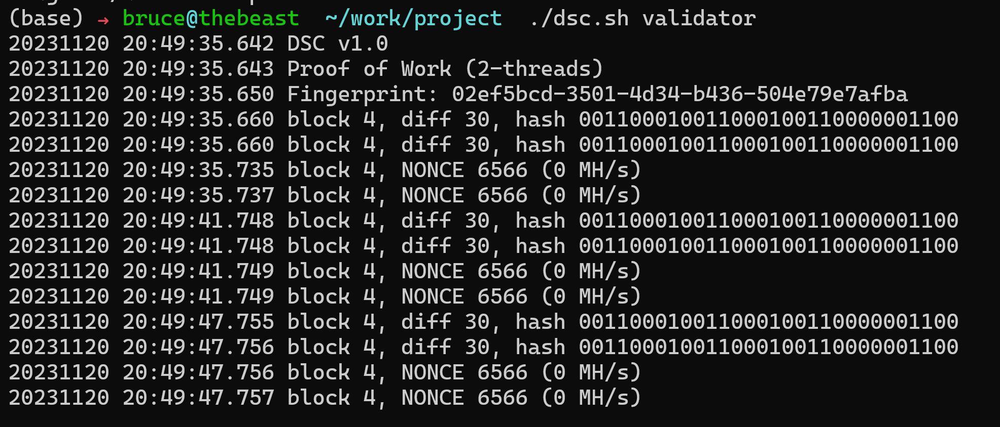

For validator POM test, be sure in dsc-config.yaml file validator/proof_pom/enable set to 'True', other is 'False':

```sh
./dsc.sh validator
```

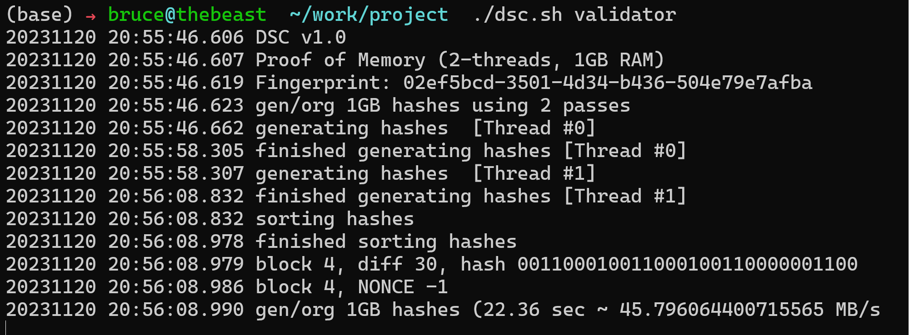
