# DataSys Coin (DSC) Blockchain

## _CS 550 Project – Final Submission_

[Features](#features) | [Compile](#compile) | [Run](#run) | [Test](#test) | [Evaluation](#evaluation) | [Run Benchmark](#run-benchmark) | [Collect Experiment Results](#collect-experiment-result)

## Features

In this final version, key features as following:

- Implement **_Proof of Storage(PoS)_** consensus algorithm and a proof of space checker.
- Utilizing SHA256 and Blake3 hashing algorithms.
- Read/Write config file in YAML, and set dsc-key.yaml permission to 400.
- Store the config file in Base58 encoding.
- Utilizing java multithreading pool technology，build an efficient Centralized Blockchain system.
- Utilizing java ScheduledExecutorService implemet asynchronous task execute periodically while server accept the request normally.

## Function Overview

Base on the outline requirements of final, I implement Blockchain functions as following:

- For wallet: create wallet(if dsc-key.yaml already exists, wallet create aborted), key operation, balance operation, send operation, transaction operation.
- For blockchain: store blocks,offer interfaces to interact with this blockchain, such as retrieve the last block header upon request,lookup the state of a transaction,lookup the
  balance of an address, etc.
- For pool: receive transaction, create submitted and unconfirmed data structures which combine queue and hashmap.
- For metronome: dynamic difficulty, create empty block every 6 seconds, accept validators register and report statistics data.
- For monitor: collect statistics of the running system.
- For validator: all functionalities requested in reuirments were realized, including PoW , PoM and PoS consensus algorithms.
- For PoW: execute the PoW algorithm for the duration of the block time.
- For PoM: store the hashes in-memory file, using java 'Arrays.sort' sort them and lookups with binary search.
- For PoS: generate the hashes first, utilizing java 'RandomAccessFile' go directly to the bucket on disk, sort using os 'sort' and perform lookups with binary search.
- Evaluation: conduct 1/2/4/8 nodes latency and throughput benchmark, working with PoW/PoM/PoS under multiple concurrent wallets as well as multiple concurrent validators.

## Devolepment

The source code files in the final requirments are shown below:
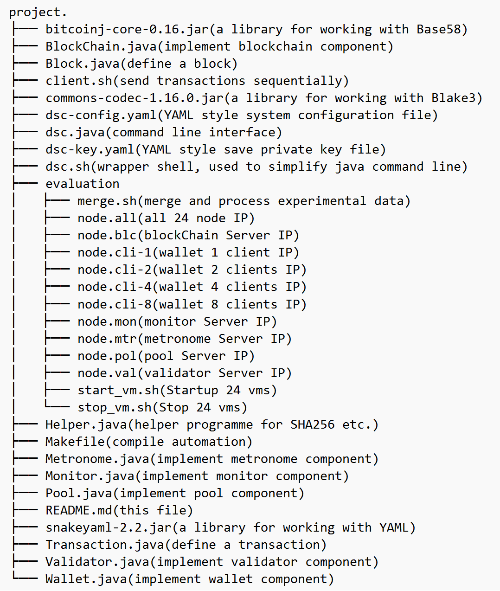

## Environment

- **OS** ubuntu 22.04 jammy.
- **Java** openjdk 11.
- **External Library** bitcoinj-core-0.16.jar, commons-codec-1.16.0.jar and snakeyaml-2.2.jar.

## compile

```sh
make clean
make
```

## run

You can use java command line:

```sh
java -Xmx26g -Xbootclasspath/a:snakeyaml-2.2.jar:bitcoinj-core-0.16.jar:commons-codec-1.16.0.jar dsc help
```

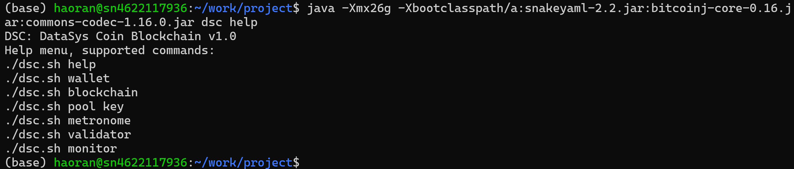
or use bash shell tool:

```sh
chmod +x ./dsc.sh
./dsc.sh help
```

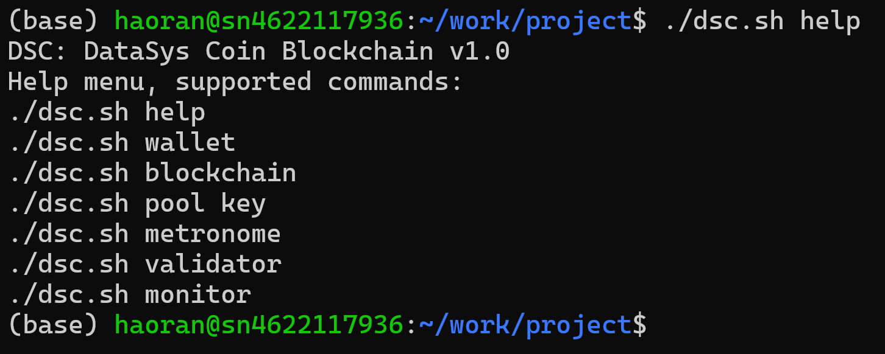

## Test

For interactive test, first startup pool server, then blcokchain erver, metronome server, monitor server use command as following:

```sh
./dsc.sh pool
```

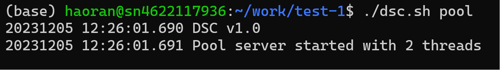
When no transactions to be confirmed, pool will print message as follows(not program error):
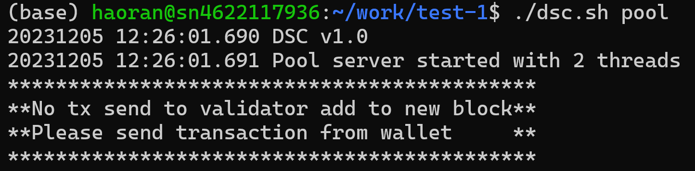

```sh
./dsc.sh blockchain
```

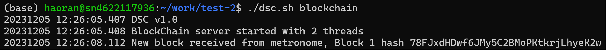

```sh
./dsc.sh metronome
```

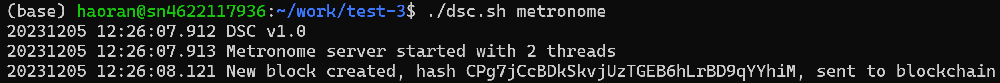

```sh
./dsc.sh monitor
```

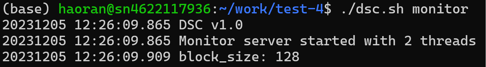
For wallet test:

```sh
./dsc.sh wallet create
```

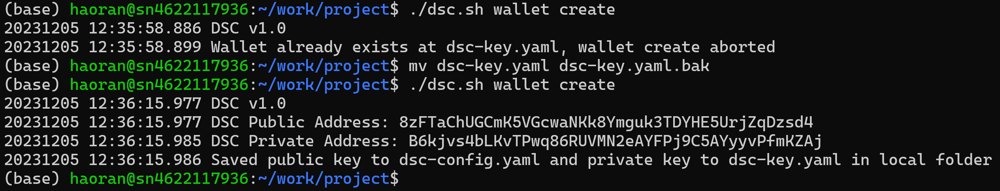

```sh
./dsc.sh wallet key
```

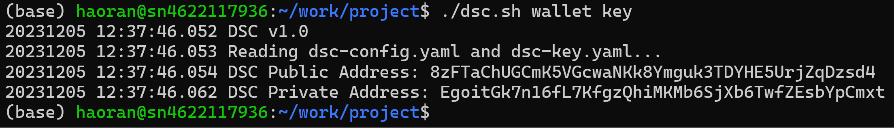

```sh
./dsc.sh wallet balance
```

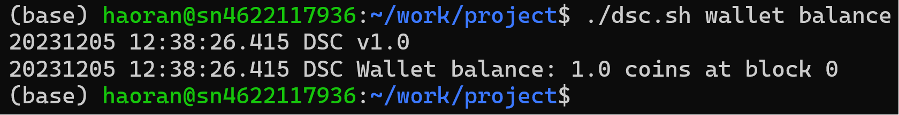

```sh
./dsc.sh wallet send 1.0 GWkg3ft9uvGqpXEbqzjhVGbeeVimgFY9MTs69t25VibB
```

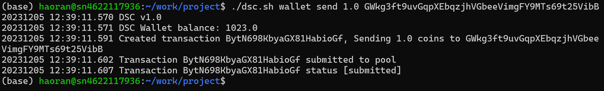

```sh
./dsc.sh wallet transaction EksacU61zEbu5kP6WBTW48
```

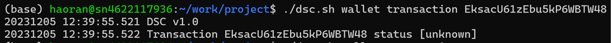

```sh
./dsc.sh wallet transaction
```

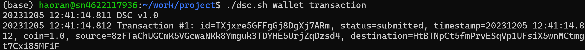

For validator POW test, be sure in dsc-config.yaml file validator/proof_pow/enable set to 'True', other is 'False':

```sh
./dsc.sh validator
```

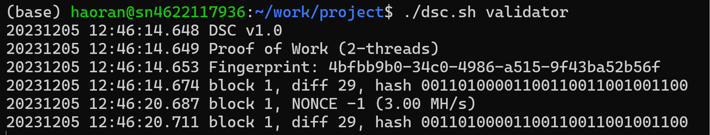

For validator POM test, be sure in dsc-config.yaml file validator/proof_pom/enable set to 'True', other is 'False':

```sh
./dsc.sh validator
```

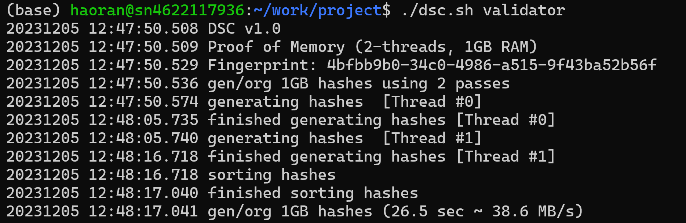
For validator POW test, be sure in dsc-config.yaml file validator/proof_pow/enable set to 'True', other is 'False':

```sh
./dsc.sh validator
```

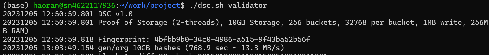
For validator pow sanity check:

```sh
./dsc.sh validator pos_check
```

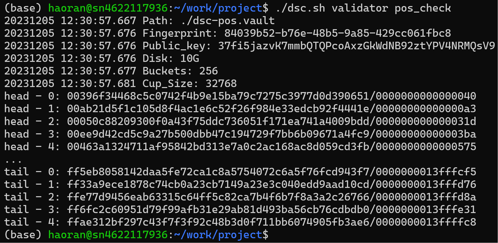

## Evaluation

### Build Benchmark Environment

**1.Create 24 VMs, 2-cores with 4GB of RAM each**

Start the interactive configuration process, accept the default/yes to everything:

```sh
sudo lxd init
```

Allow traffic from lxdbr0 interface to the LXD host:

```sh
sudo ufw allow in on lxdbr0
sudo ufw route allow in on lxdbr0
sudo ufw route allow out on lxdbr0
```

Create dir type storage pool:

```sh
sudo lxc storage create simba_pool dir source=/home/haoran/work/storage
```

Replace default storage pool:

```sh
sudo lxc profile device set default root pool=simba_pool
```

Create seed vm(simba01), ubuntu 22.04, 2-core, 4GB RAM:

```sh
sudo lxc launch images:ubuntu/22.04 simba01 --vm -c limits.cpu=2 -c limits.memory=4GiB
```

Install required software to run DSC blockchain on simba01:

```sh
sudo apt-get install openjdk-11-jdk
sudo apt-get install openssh-server
sudo apt-get install net-tools
sudo apt-get install build-essential manpages-dev
```

Clone other 23 VMs, simba02 for example:

```sh
lxc copy simba01 simba02
```

Mapping of vm name and IP as follow:
simba01 10.191.28.58
simba02 10.191.28.150
simba03 10.191.28.175
simba04 10.191.28.6
simba05 10.191.28.172
simba06 10.191.28.65
simba07 10.191.28.129
simba08 10.191.28.7
simba09 10.191.28.176
simba10 10.191.28.195
simba11 10.191.28.207
simba12 10.191.28.237
simba13 10.191.28.197
simba14 10.191.28.32
simba15 10.191.28.242
simba16 10.191.28.243
simba17 10.191.28.37
simba18 10.191.28.83
simba19 10.191.28.3
simba20 10.191.28.64
simba21 10.191.28.71
simba22 10.191.28.151
simba23 10.191.28.219
simba24 10.191.28.101

Create public/private key pair to enable ssh, simba02 for example:

```sh
sudo ssh-keygen -f /home/haoran/.ssh/keys/simba02
sudo ssh-copy-id -i /home/haoran/.ssh/keys/simba02 haoran@10.191.28.150
```

Copy source code to each vm:

```sh
cd ./evaluation
sshpass -p password parallel-ssh -i -h node.all -l haoran -A "mkdir /home/haoran/project"
sshpass -p password parallel-scp -h node.all -l haoran -A ../* /home/haoran/project
```

### Run Benchmark

Compile on each vm:

```sh
cd ./evaluation
sshpass -p password parallel-ssh -i -h node.all -l haoran -A "cd /home/haoran/project;make clean;make"
```

Modify dsc-config.yaml to change type of validator, PoW, PoM, and PoW in host, release to each nodes:

```sh
cd ./evaluation
sshpass -p password parallel-scp -h node.all -l haoran -A ../dsc-config.yaml /home/haoran/project
```

Startup Pool server:

```sh
cd ./evaluation
sshpass -p password parallel-ssh -i -h node.pol -l haoran -A --par 50 --timeout 0 "cd /home/haoran/project;./dsc.sh pool"
```

Startup Blockchain server:

```sh
cd ./evaluation
sshpass -p password parallel-ssh -i -h node.blc -l haoran -A --par 50 --timeout 0 "cd /home/haoran/project;./dsc.sh blockchain"
```

Startup Metronome server:

```sh
cd ./evaluation
sshpass -p password parallel-ssh -i -h node.mtr -l haoran -A --par 50 --timeout 0 "cd /home/haoran/project;./dsc.sh metronome"
```

Startup Monitor server:

```sh
cd ./evaluation
sshpass -p password parallel-ssh -i -h node.mon -l haoran -A --par 50 --timeout 0 "cd /home/haoran/project;./dsc.sh monitor"
```

Startup validator:

```sh
cd ./evaluation
sshpass -p password parallel-ssh -i -h node.val -l haoran -A --par 50 --timeout 0 "cd /home/haoran/project;./dsc.sh validator"
```

For Latency experiment, 8 node benchmark clients for example:

```sh
cd ./evaluation
sshpass -p password parallel-ssh -i -h node.cli-8 -l haoran -A --par 50 --timeout 0 "cd /home/haoran/project;./client.sh 128"
```

For Throughput experiment, 8 node benchmark clients for example:

```sh
cd ./evaluation
sshpass -p password parallel-ssh -i -h node.cli-8 -l haoran -A --par 50 --timeout 0 "cd /home/haoran/project;./client.sh 128000"
```

Error handle, kill all instance:

```sh
cd ./evaluation
sshpass -p password parallel-nuke -h node.all -v -l haoran -A java
```

### Collect Experiment Result

Get wallet submission experimental data:

```sh
cd ./evaluation
sshpass -p password parallel-slurp -h node.cli-8 -l haoran -A -L ./submission /home/haoran/project/Wallet_Send.log Wallet_Send.log
```

Get transaction confirmation experimental data:

```sh
cd ./evaluation
sudo lxc file pull simba01/home/haoran/project/Tx_Confirmed.log ./
```

Merge and process experimental data, pow/8 clients/128000 transactions for example:

```sh
cd ./evaluation
chmod +x ./merge.sh
./merge.sh pow_8_128000
```
